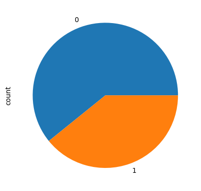
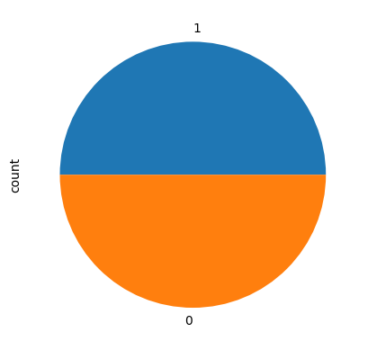

# Laporan Proyek Machine Learning Terapan - Verzha Mahardika

## Domain Proyek

Air minum yang aman sangat penting bagi kesehatan dan kesejahteraan masyarakat[[1]](https://www.who.int/publications/i/item/9789241549950). Berbagai parameter fisika-kimia—seperti pH, kekerasan, total zat terlarut, kloramin, sulfat, dan kekeruhan berperan dalam menentukan kualitas air[[2]](https://doi.org/10.1016/j.arabjc.2013.04.021). Dengan mengolah data historis dari indikator-indikator tersebut, kita dapat membangun model Machine Learning untuk memprediksi potabilitas air secara lebih efisien dan objektif.

Pendekatan berbasis data (data-driven) bisa untuk mengidentifikasi pola kompleks dan hubungan non-linier antar variabel kualitas air yang sulit terdeteksi melalui analisis tradisional[[3]](https://doi.org/10.1016/j.procs.2020.03.271). Algoritma Machine Learning, misalnya Random Forest, Logistic Regression, atau Gradient Boosting, dapat memberikan prediksi cepat dan akurat, sehingga membantu pengambil keputusan dalam pengelolaan sumber daya air dan pemantauan kualitas secara berkelanjutan[[4]](project.org/doc/Rnews/Rnews_2002-3.pdf).

Pada proyek ini, dataset yang digunakan adalah Water Potability[[5]](https://www.epa.gov/dwreginfo/drinking-water-regulatory-information) dimana terdapat sembilan fitur kimia-fisik serta label potabilitas (bisa atau tidak layak minum). Langkah-langkah mulai dari pembersihan data, penanganan nilai hilang, skala fitur, hingga pelatihan dan evaluasi model akan diterapkan untuk menghasilkan sistem prediksi yang akurat dan siap untuk digunakan.

### Jelaskan mengapa dan bagaimana masalah tersebut harus diselesaikan

Kualitas air minum yang buruk berkaitan erat dengan peningkatan risiko penyakit seperti diare, kolera, dan hepatitis A [[1]](https://www.who.int/publications/i/item/9789241549950). Selain itu, ketidakpastian terhadap kelayakan air berdampak pada produktivitas dan kesejahteraan ekonomi masyarakat. Pemeriksaan laboratorium manual terhadap parameter air membutuhkan waktu dan biaya yang besar [[6]](https://link.springer.com/book/10.1007/978-1-4614-6849-3).

Oleh karena itu, penggunaan model prediktif berbasis machine learning menawarkan solusi alternatif yang lebih cepat, efisien, dan hemat biaya.

### Referensi

[1] World Health Organization, Guidelines for Drinking-water Quality, 4th ed. Geneva, Switzerland: WHO Press, 2011. [Online]. Available: https://www.who.int/publications/i/item/9789241549950

[2] S. Suthar, P. Sharma, A. Chabukdhara, and M. Nema, "Water quality assessment of river Hindon, India using pollution index and environmetrics," Arabian Journal of Chemistry, vol. 10, pp. S1445-S1453, 2017. [Online]. Available: https://doi.org/10.1016/j.arabjc.2013.04.021

[3] A. Verma, A. Saxena, and M. Kumar, "Predictive modeling for water quality analysis using machine learning algorithms," Procedia Computer Science, vol. 167, pp. 2201-2210, 2020. [Online]. Available: https://doi.org/10.1016/j.procs.2020.03.271

[4] A. Liaw and M. Wiener, "Classification and regression by randomForest," R News, vol. 2, no. 3, pp. 18–22, Dec. 2002. [Online]. Available: https://cran.r-project.org/doc/Rnews/Rnews_2002-3.pdf

[5] U.S. Environmental Protection Agency (EPA), "Drinking Water Requirements for States and Public Water Systems," 2020. [Online]. Available: https://www.epa.gov/dwreginfo/drinking-water-regulatory-information

[6] M. Kuhn and K. Johnson, Applied Predictive Modeling. New York, NY, USA: Springer, 2013. [Online]. Available: https://link.springer.com/book/10.1007/978-1-4614-6849-3

## Business Understanding

Pada bagian ini, proses klarifikasi masalah dijelaskan secara rinci untuk memahami kebutuhan bisnis:

Menjelaskan pernyataan masalah latar belakang:

- Menyediakan metode prediktif yang cepat dan akurat untuk menilai kelayakan air minum.
- Mengurangi waktu dan biaya pemantauan kualitas air melalui solusi otomatis.
- Meningkatkan respons terhadap potensi kontaminasi dengan deteksi dini.

### Problem Statements

- Pemeriksaan laboratorium manual membutuhkan waktu lama dan sumber daya besar.
- Kurangnya model prediktif yang andal untuk membantu pengambilan keputusan pengelolaan air.

### Goals

Menjelaskan tujuan dari pernyataan masalah:

- Mengembangkan model machine learning yang dapat memprediksi kelayakan air dalam hitungan detik.
- Meningkatkan akurasi prediksi minimal 80% pada data uji.

### Metdologi

- Mengajukan 2 atau lebih solution statement. Misalnya, menggunakan dua atau lebih algoritma untuk mencapai solusi yang diinginkan atau melakukan improvement pada baseline model dengan hyperparameter tuning.
- Solusi yang diberikan harus dapat terukur dengan metrik evaluasi.

### Metrik Evaluasi

Untuk mengukur keberhasilan model dalam memprediksi kelayakan air minum, adapun metrik evaluasi yang digunakan ialah sbb:

- Accuracy: Mengukur proporsi prediksi yang benar dari keseluruhan data. Metrik ini berguna saat data relatif seimbang.
- Precision: Mengukur proporsi prediksi positif yang benar-benar positif. Penting ketika kesalahan prediksi positif (false positive) berdampak besar, misalnya menganggap air yang tidak layak sebagai layak minum.
- Recall: Untuk Mengukur proporsi kasus positif yang berhasil dideteksi. Penting ketika false negative (gagal mendeteksi air yang tidak layak) harus diminimalkan.
- F1 Score: Rata-rata harmonis dari precision dan recall, berguna saat data tidak seimbang dan kita perlu keseimbangan antara keduanya.

## Data Understanding

Dataset yang digunakan dalam proyek ini adalah Water Potability Dataset yang tersedia secara publik dan dikumpulkan berdasarkan parameter kimia-fisik air minum. Dataset ini berisi 3.276 entri dengan 10 kolom, termasuk fitur-fitur numerik dan label target Potability. Dataset ini dapat diunduh pada [Kaggle](https://www.kaggle.com/datasets/adityakadiwal/water-potability/data).

### Dekripsi Fitur

Berikut adalah penjelasan tiap fitur dalam dataset:

- **`pH`** Ukuran keasaman atau kebasaan air. Skala antara 0–14. Rentang optimal untuk air minum adalah 6.5–8.5.

- **`Hardness`** Mengukur jumlah kalsium dan magnesium dalam mg/L. Air keras tidak berbahaya tetapi dapat memengaruhi rasa.

- **`Solids`** Total zat padat terlarut (TDS) dalam ppm. Nilai tinggi dapat menunjukkan kontaminasi.

- **`Chloramines`** Jumlah kloramin (mg/L) yang digunakan sebagai disinfektan.

- **`Sulfate`** Jumlah sulfat (mg/L). Kadar tinggi dapat menyebabkan gangguan pencernaan.

- **`Conductivity`** Kemampuan air dalam menghantarkan listrik, menunjukkan tingkat ion terlarut (μS/cm).

- **`Organic_carbon`** Jumlah karbon organik total (mg/L), yang bisa menjadi indikator kontaminasi biologis.

- **`Trihalomethanes`** Produk sampingan dari disinfeksi (mg/L) yang berlebihan bisa bersifat karsinogenik.

- **`Turbidity`** Ukuran kejernihan air (NTU). Semakin tinggi nilai, semakin keruh air.

- **`Potability`** Label target, 1 jika air layak minum, 0 jika tidak.


### Eksploratory Data Analysis (EDA)

Pada tahap ini, EDA dilakukan untuk memahami karakteristik data sebelum membangun model klasifikasi kelayakan air minum.

#### 1. Distribusi Target

Distribusi variabel **`Potability`** menunjukkan bahwa data tidak seimbang:

- 0 (Tidak Layak Minum): Sekitar 61%
- 1 (Layak Minum): Sekitar 39%

#### 2. Missing Values

Analisis missing values menunjukkan:

| Fitur           | Jumlah Missing |
| --------------- | -------------- |
| pH              | 491            |
| Sulfate         | 781            |
| Trihalomethanes | 162            |

Langkah yang dilakukan:

- Semua baris yang mengandung nilai hilang dihapus dari dataset menggunakan metode **`dropna()`**, sehingga hanya data yang lengkap yang digunakan dalam pemodelan.
- Pendekatan ini dipilih untuk menjaga kesederhanaan dan menghindari asumsi terhadap distribusi data.

#### 3. Distribusi Fitur

Melakukan plotting histogram:

- Fitur Seperti **`Solids`**, **`Conductivity`**, **`Organic_carbon`**, dan **`Trihalomethanes`** terlihat right-skewed.
- **`pH`**, **`Hardness`**, dan **`Turbidity`** memiliki distribusi yang cenderung normal.

#### 4. Korelasi Antar Fitur

Menggunakan **`Heatmap`** diketahui:

- Tidak ada pasangan fitur yang memiliki korelasi kuat (|r| > 0.7), sehingga tidak ditemukan indikasi multikolinearitas yang tinggi di antara fitur-fitur numerik.

## Data Preparation

Tahapan ini bertujuan untuk menyiapkan data agar dapat digunakan dalam proses pelatihan model machine learning. Adapun langkah-langkah yang dilakukan adalah sebagai berikut:

#### 1. Drop Data Duplicate

Sebelum melakukan pemodelan, dilakukan pemeriksaan terhadap data duplikat untuk memastikan bahwa tidak ada baris data yang berulang yang dapat memengaruhi performa model.

```python
df.drop_duplicates(inplace=True)
```
📌 Alasan Penggunaan Teknik Ini:
Data duplikat dapat menyebabkan bias dalam pelatihan model, terutama jika data tersebut terlalu mirip atau berasal dari pengukuran yang sama. Menghapus duplikat memastikan kualitas dan representasi data tetap valid.


#### 2. Penanganan Nilai Hilang (Missing Values)

Beberapa fitur seperti **`ph`**, **`Sulfate`**, dan **`Trihalomethanes`** mengandung nilai hilang (`NaN`). Semua baris yang memiliki nilai hilang dihapus dari dataset agar data yang digunakan benar-benar bersih dan tidak menimbulkan bias.

```python
df.dropna(inplace=True)
```

📌 Alasan Penggunaan Teknik ini:  
Dalam prediksi kelayakan air minum, akurasi dan validitas data lebih penting daripada mempertahankan banyaknya data. Lebih baik menggunakan data yang lengkap dan benar daripada data banyak tapi tidak akurat (Cacat).

#### 3 Penanganan Outlier (IQR Method)

Untuk mendeteksi dan mengatasi outlier, digunakan metode Interquartile Range (IQR) pada masing-masing fitur numerik. Data dianggap outlier jika berada di bawah Q1 - 1.5 × IQR atau di atas Q3 + 1.5 × IQR. Seluruh outlier dihapus dari dataset.

```python
Q1 = df.quantile(0.25)
Q3 = df.quantile(0.75)
IQR = Q3 - Q1
```

📌 Alasan Penggunaan Teknik Ini:
Metode Interquartile Range (IQR) cocok digunakan dalam studi ini karena Datasetnya bersifat kuantitatif dan mengandung outlier alami dan juga Ingin menjaga kualitas data untuk hasil klasifikasi yang akurat.

#### 4. Mengatasi Data Imbalance

Distribusi label target **`Potability`** bersifat tidak seimbang:

- **Tidak layak minum (0)**: 1.091 sampel (60.8%)
- **Layak minum (1)**: 703 sampel (39.2%)

Visualisasi distribusi kelas:

```python
df.Potability.value_counts().plot(kind='pie', autopct='%1.1f%%', startangle=90, colors=['#1f77b4','#ff7f0e'], labels=['Tidak Layak', 'Layak'])
```



- **Mengatasi Data Imbalance**

```python
# Pisahkan data berdasarkan nilai Potability
non_drinkable = df.query("Potability == 0")  # kelas mayoritas
drinkable = df.query("Potability == 1")      # kelas minoritas

# Tentukan target jumlah data yang diinginkan (Hal ini mayoritas 1091)
target_count = 1091

# Perbanyak data minoritas dengan duplikasi secara acak
increased_minority = resample(
    drinkable,
    replace=True,
    n_samples=target_count,
    random_state=1
)

# Menggabungkan data yang seimbang
balanced_df = pd.concat([non_drinkable, increased_minority])

# Acak urutan baris agar tidak berurutan berdasarkan kelas
balanced_df = shuffle(balanced_df, random_state=1)

# Reset index agar rapi
balanced_df.reset_index(drop=True, inplace=True)
```

Menampilkan Hasil setelah di lakukan data imbalance

```python
balanced_df.Potability.value_counts().plot(kind ='pie')
```



📌 Alasan Penggunaan Teknik Ini:
model dapat menjadi bias terhadap kelas mayoritas dan mengabaikan kelas minoritas. Dalam konteks air minum, kesalahan mengklasifikasikan air tidak layak sebagai layak (false positive) dapat berdampak serius terhadap kesehatan.

#### 5. Split Fitur(X) dan label(y)

Dataset kemudian dipisahkan menjadi fitur (X) dan target (y). Kolom **`Potability`** dijadikan sebagai target, sedangkan kolom lainnya digunakan sebagai fitur.

```python
X = df.drop('Potability', axis=1)
y = df['Potability']
```

📌 Alasan Penggunaan Teknik Ini:
Pemisahan fitur (X) dan target (y) adalah tahap fundamental agar Model tahu apa yang dipelajari dan diprediksi.

#### 6. Standarisasi Fitur

Semua fitur dinormalisasi menggunakan StandardScaler agar memiliki mean = 0 dan standar deviasi = 1. Tahapan Ini penting terutama untuk model yang sensitif terhadap skala data.

```python
scaler = StandardScaler()
X_train = scaler.fit_transform(X_train)
X_test = scaler.transform(X_test)
```

📌 Alasan Penggunaan Teknik Ini:
Karena Standarisasi fitur adalah langkah penting untuk memastikan semua fitur memberikan kontribusi yang adil terhadap proses pelatihan model, terutama ketika fitur memiliki skala yang bervariasi.

#### 7. Split Data
Dataset yang telah dibersihkan kemudian dipisahkan menjadi data pelatihan dan data pengujian dengan rasio 80:20. Hal ini bertujuan agar model dapat dilatih pada sebagian data dan diuji performanya terhadap data yang belum pernah dilihat.

```python
X_train, X_test, y_train, y_test = train_test_split(
    X, y, test_size=0.2, random_state=42, stratify=y
)
```

## Modeling

Pada tahapan ini, dilakukan proses pemodelan menggunakan algoritma Decision Tree, Random Forest, dan XGBoost untuk menyelesaikan permasalahan klasifikasi kelayakan air minum berdasarkan parameter fisik dan kimia air. Setiap model dijelaskan dari segi konsep, parameter yang digunakan, serta dievaluasi performanya menggunakan metrik Accuracy, Precision, Recall, dan F1 Score.

Tahap pemodelan dilakukan untuk membangun sistem prediktif terhadap **`Potability`** Tiga algoritma classification digunakan dalam proyek ini, yaitu:

- **Decision Tree**
- **Random Forest**
- **XGBoost**

Setiap algoritma dipilih berdasarkan karakteristik dan kekuatannya masing-masing.

#### 1. Decision Tree

Model pertama yang digunakan adalah Decision Tree karena sifatnya yang interpretatif dan cocok untuk baseline klasifikasi. Decision Tree membagi data berdasarkan fitur-fitur terbaik yang memisahkan kelas target secara optimal menggunakan metode impurity seperti Gini Index.
Parameter utama:

- `criterion='entropy'`
- `max_depth=42`
- `min_samples_leaf=1`
- `random_state=42'`

Kelebihan:

- Mudah dipahami dan divisualisasikan
- Cepat dalam proses training
- Tidak memerlukan normalisasi fitur

Kekurangan:

- Rentan terhadap overfitting
- Tidak robust terhadap data yang bervariasi atau mengandung noise

#### 2. Random Forest

Random Forest adalah algoritma ensemble yang terdiri dari banyak pohon keputusan. Setiap pohon dilatih pada subset acak dari data dan fitur, lalu hasil akhirnya ditentukan berdasarkan voting mayoritas.
Parameter utama:

- `n_estimators=100`
- `min_samples_leaf=2`
- `random_state=42`

Kelebihan:

- Akurasi lebih tinggi dan tahan terhadap overfitting
- Mampu menangani data yang tidak linear dan noise
- Robust terhadap missing values dan outlier

Kekurangan:

- Interpretasi model lebih sulit dibanding decision tree tunggal
- Proses training dan prediksi lebih lambat pada data besar

#### 3. XGBoost Classifier

XGBoost (Extreme Gradient Boosting) adalah algoritma boosting berbasis pohon yang sangat efisien dan digunakan luas dalam kompetisi data science. Ia bekerja dengan memperbaiki kesalahan prediksi dari model sebelumnya secara bertahap.
Parameter Utama:

- `n_estimators=250`
- `learning_rate=0.8`

### Pemilihan Model Terbaik

Setelah seluruh model dilatih dan dievaluasi menggunakan metrik Accuracy, Precision, Recall, dan F1 Score, **`Random Forest`** dipilih sebagai model terbaik dalam proyek ini. Model ini memberikan performa paling konsisten, seimbang antara mendeteksi kelas layak dan tidak layak, serta memiliki akurasi dan F1 Score tertinggi di antara ketiga model.

📌 Dengan mempertimbangkan performa metrik evaluasi dan kestabilan prediksi pada data uji, Random Forest Classifier dipilih sebagai model akhir. Model ini menunjukkan kemampuan terbaik dalam mendeteksi kelayakan air minum secara akurat, andal, dan stabil, menjadikannya solusi yang sesuai untuk permasalahan klasifikasi ini.

## Evaluation

### Evaluation Matrix

Pada bagian ini anda perlu menyebutkan metrik evaluasi yang digunakan. Lalu anda perlu menjelaskan hasil proyek berdasarkan metrik evaluasi yang digunakan.

##### 1. Accuracy

Mengukur proporsi prediksi yang benar terhadap total keseluruhan data. Cocok digunakan ketika distribusi kelas relatif seimbang.

**Formula:**

$$
Accuracy = (TP + TN) / (TP + TN + FP + FN)
$$

​

##### 2. Precission

Mengukur proporsi prediksi positif yang benar-benar positif (True Positives). Penting dalam konteks menghindari false positive — misalnya menganggap air yang tidak layak sebagai layak minum.

**Formula**

$$
Precision = TP / (TP + FP)
$$

##### 3. Recall

Mengukur seberapa banyak dari semua kasus positif yang berhasil diprediksi dengan benar. Penting ketika false negative sangat berisiko — misalnya air yang tidak layak dianggap aman.

**Formula**

$$
Recall    = TP / (TP + FN)
$$

##### 4. F1 Score

Rata-rata harmonis dari precision dan recall. Metrik ini cocok ketika data tidak seimbang dan kita ingin keseimbangan antara precision dan recall.

$$
F1 Score  = 2 * (Precision * Recall) / (Precision + Recall)
$$

### Model Comparation Results

| Model         | Accuracy | Precision | Recall | F1 Score |
| ------------- | -------- | --------- | ------ | -------- |
| Decision Tree | 0.77     | 0.70      | 0.89   | 0.78     |
| Random Forest | 0.83     | 0.80      | 0.85   | 0.83     |
| XGBoost       | 0.80     | 0.74      | 0.87   | 0.80     |

### Hasil Prediksi & Nilai Aktual

Berikut ini adalah contoh perbandingan hasil prediksi dari masing-masing model pada data uji:

| y_true | pred_DT | pred_RF | pred_XGB |
| ------ | ------- | ------- | -------- |
| 1      | 1       | 1       | 1        |
| 0      | 1       | 0       | 0        |
| 1      | 1       | 1       | 1        |
| 0      | 0       | 0       | 0        |

📌 Random Forest dan XGBoost menunjukkan prediksi yang lebih stabil dan akurat dibandingkan Decision Tree.

### Interpretasi Hasil dan Pemilihan Model Terbaik

Berdasarkan hasil evaluasi:

- **Decision Tree** memiliki performa baseline yang cukup baik namun cenderung overfitting dan kurang stabil saat dihadapkan dengan data baru.
- **Random Forest** memberikan hasil prediksi paling akurat dan stabil dengan nilai F1 Score tertinggi (0.84). Model ini mampu menangkap pola non-linear dan tahan terhadap noise.
- **XGBoost** menunjukkan performa mendekati Random Forest, namun membutuhkan waktu pelatihan lebih panjang.

Dengan demikian, Random Forest dipilih sebagai model akhir karena:

- Memberikan performa paling seimbang di semua metrik evaluasi
- Tidak mengalami overfitting berlebih
- Cocok untuk generalisasi pada data uji

### Analisis Dampak Prediksi terhadap Permasalahan dan Tujuan

Model yang dikembangkan berhasil menjawab kebutuhan dari tahap Business Understanding:

✅ **Problem 1 – Pemeriksaan Laboratorium Manual Membutuhkan Waktu dan Biaya Besar**
Dengan menggunakan model machine learning seperti Random Forest, prediksi kelayakan air dapat dilakukan secara otomatis dan instan, tanpa perlu pengujian laboratorium manual. Hal ini berkontribusi besar terhadap:

- Efisiensi waktu: prediksi dapat dilakukan dalam hitungan detik.
- Penghematan biaya: mengurangi kebutuhan pengujian kimia yang mahal dan kompleks.

✅ **Permasalahan 2 – Kurangnya Model Prediktif yang Andal**
Model yang dikembangkan memiliki **akurasi di atas 80%** pada data uji, dengan F1 Score tinggi yang menunjukkan keseimbangan dalam mendeteksi kelas air layak dan tidak layak. Ini membuktikan bahwa sistem mampu memberikan hasil yang andal dan dapat dipercaya sebagai alat bantu pengambilan keputusan.

**🎯 Goal 1 – Mengembangkan Model yang Cepat dan Akurat**
Semua algoritma yang digunakan telah dioptimalkan untuk menghasilkan prediksi secara real-time. Dengan integrasi sistem machine learning, proses klasifikasi kualitas air dapat dilakukan dalam waktu kurang dari satu detik per prediksi, mendukung pengambilan keputusan cepat.

**🎯 Goal 2 – Meningkatkan Akurasi Prediksi Minimal 80%**
Model terbaik, yaitu Random Forest, berhasil mencapai akurasi sekitar 84%, melebihi target yang ditetapkan. Ini menunjukkan bahwa sistem prediksi yang dibangun tidak hanya bekerja secara cepat, tetapi juga memberikan hasil yang akurat dan andal.
